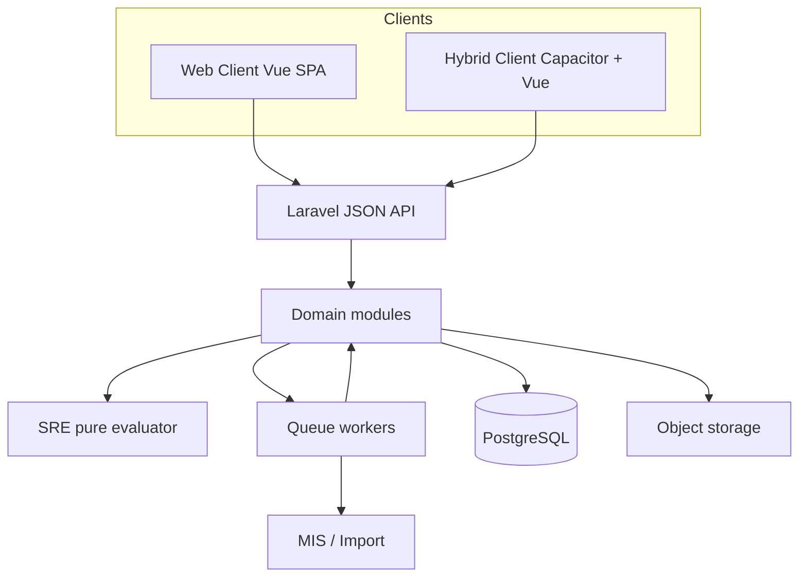
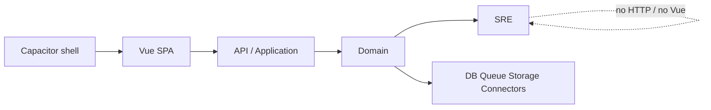
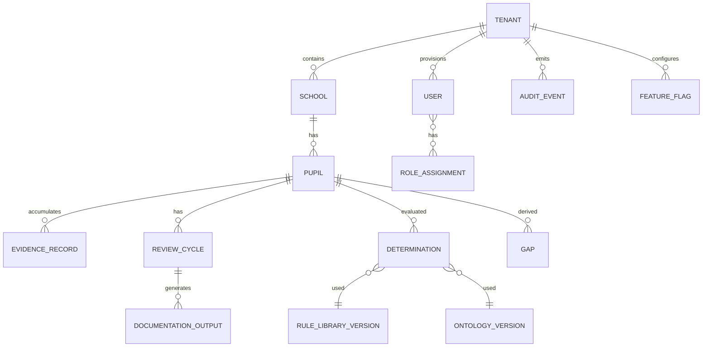
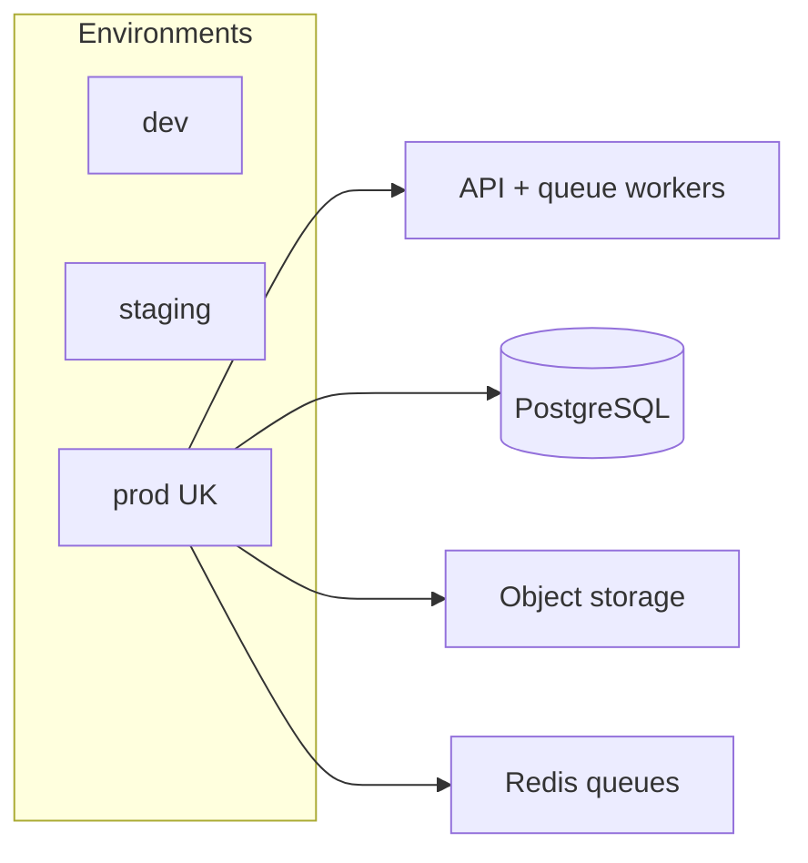

# Architecture Spine — GuidelyEdu

## Design Paradigm

**Modular monolith.** One deployable Laravel application at the **repository root** owns tenancy, identity, domain writes, Statutory Reasoning Engine (SRE), jobs, and integrations. Presentation is a Vue 3 SPA (Vue Router + JSON API clients) co-located under `resources/js`, consumed by browser (Web Client) and later Capacitor shell (Hybrid Client). Domain modules are boundaries inside the monolith (namespaces + DB ownership), not independent services.

**Layout note (2026-09-05):** Classic **root Laravel** layout — `composer.json` / `app/` / `routes/` at project root. Vue lives in `resources/js` and is built with Vite (`laravel-vite-plugin`). **Inertia is not used** for Role product surfaces: the SPA talks only to the versioned JSON API (AD-1). A single Blade view may exist solely as the SPA HTML shell that loads the Vite entry.

| Layer | Maps to |
|---|---|
| Presentation | `resources/js` Vue SPA (+ Capacitor wrapper later) |
| Application API | Laravel HTTP/JSON API, policies, form requests |
| Domain | Tenancy, Pupils/Evidence, Ontology/Rules, SRE, Outputs, Reporting, Connectors |
| Infrastructure | PostgreSQL, queue workers, object storage, MIS connectors |



## Invariants & Rules

### AD-1 — Single API for all clients `[ADOPTED]`

- **Binds:** Web Client, Hybrid Client, FR-19
- **Prevents:** Divergent business rules in Vue vs native; Inertia (or Blade-driven) server HTML as the product UI
- **Rule:** All product behaviour is reachable via versioned JSON API. Vue is presentation only (client-side router + fetch/XHR to `/api/v1/*`). Hybrid uses the same API contracts. **Do not adopt Inertia** for Role product surfaces. Blade may exist only as the SPA shell (and optional ops/admin tools), never as the interactive product UI.

### AD-2 — Tenant isolation is mandatory

- **Binds:** FR-1–FR-3, all data access
- **Prevents:** Cross-Tenant reads/writes by ID guess or forgotten scope
- **Rule:** Every Tenant-owned row carries `tenant_id`. Queries and policies default to current Tenant. No global Pupil/Evidence query without an explicit platform-operator context outside Tenant Admin.

### AD-3 — Authorization on the API, not the router

- **Binds:** FR-5–FR-7, FR-54, addendum permission matrix
- **Prevents:** “Hidden nav = secure”
- **Rule:** Laravel policies/gates enforce the addendum matrix on every mutating and sensitive read endpoint. Vue Role menus are UX only.

### AD-4 — SRE is deterministic domain code

- **Binds:** FR-26–FR-35, FR-29
- **Prevents:** LLM/microservice “AI” Determinations; non-repeatable evaluations
- **Rule:** SRE is an in-process pure evaluator: `(Evidence Base snapshot, Ontology version, Rule Library version) → Determinations + Reasoning Pathways`. No generative model calls on this path. Same inputs → same outputs (FR-29).

### AD-5 — Rules and Ontology are versioned data

- **Binds:** FR-23–FR-25, FR-27, FR-56, FR-60
- **Prevents:** Silent rewrite of historical Determinations; hard-coded Rule logic in controllers
- **Rule:** Ontology terms and Rules live in versioned tables (or versioned artefacts imported into tables). Each Determination stores the Ontology + Rule Library versions used. Publishing a new version does not mutate past Determinations.

### AD-6 — Evidence write → async SRE re-eval

- **Binds:** FR-28, NFR-1, NFR-2
- **Prevents:** Blocking HTTP on full Pupil re-evaluation; stale status without a job trail
- **Rule:** Creating/amending/importing Evidence Records commits synchronously; SRE re-evaluation is enqueued. Documentation status may show “evaluating” until the job completes. Drafts never enter SRE (FR-18).

### AD-7 — Audit Events are append-only

- **Binds:** FR-10, FR-13 Data Governance / Audit sections
- **Prevents:** Tenant Admin purging accountability
- **Rule:** Auth, access, mutation, generation, export, Override emit Audit Events. No update/delete API for Audit Events in product UI. Soft-delete of business data must still leave Audit Event history as law allows.

### AD-8 — Feature flags gate exposure, not existence `[ADOPTED]`

- **Binds:** FR-4, first-build scope FR-1–60
- **Prevents:** Shipping half-implemented Trust/advanced code paths “later”
- **Rule:** Trust Dashboard, tribunal packs, safeguarding ingest, etc. are implemented behind Tenant flags. Disabled → explicit not-available responses, never empty “perfect” aggregates.

### AD-9 — Offline Hybrid drafts are client-local until accepted

- **Binds:** FR-19, UX offline banner
- **Prevents:** Fake server state; duplicate Pupils on sync
- **Rule:** Device queues drafts with clear “not on Evidence Base” UX. On sync, API validates; Pupil identity conflicts: **server wins**. Drafts remain author-only until accepted.

### AD-10 — Documentation Outputs require confirmed human acceptance

- **Binds:** FR-33–FR-35, FR-38–FR-41
- **Prevents:** Auto-issued “statutory” packs
- **Rule:** Generation endpoints require confirmation payload (User id + disclaimer ack). Output artefacts store confirming User, timestamps, Evidence/Determination citations, disclaimer. File bytes live in encrypted object storage; DB holds metadata + checksum.

### AD-11 — MIS is optional; Import Template is required path

- **Binds:** FR-47–FR-50, UJ-4
- **Prevents:** Blocking Pilots on Connector approval
- **Rule:** Product must onboard Pupils without a live Connector. Connectors upsert by MIS key. First standardised Connector set is Pilot-chosen (PRD OQ-4); connector adapters are swappable modules behind one interface.

### AD-12 — Dependency direction

- **Binds:** all modules
- **Prevents:** Domain depending on Vue or Capacitor; SRE depending on HTTP
- **Rule:**



Presentation → Application → Domain → Infrastructure. Domain never imports Presentation. SRE never imports HTTP or UI.

### AD-13 — UX tokens are presentation constraints `[ADOPTED]`

- **Binds:** DESIGN.md, EXPERIENCE.md
- **Prevents:** Reintroducing wireframe product IA (parent/LMS/clinician) via “design consistency”
- **Rule:** Implement DESIGN.md tokens and EXPERIENCE.md IA. Wireframe PDF is visual reference only. Glossary terms (SENCO, EHCP, Gap, Determination) are API and UI vocabulary.

### AD-14 — Data residency UK-first `[ASSUMPTION]`

- **Binds:** PRD §12, NFR privacy
- **Prevents:** Accidental multi-region PII sprawl
- **Rule:** Primary DB, object storage, and backups in UK (or explicitly UK-adequate) regions until legal amends. No Pupil analytics warehouse outside that envelope in v1.

### AD-15 — Module ownership of mutable domain state

- **Binds:** all Domain modules; Overrides; Gaps; Determinations
- **Prevents:** Two modules inventing competing mutation paths for the same entity
- **Rule:**
  - `Domain\Evidence` owns Evidence Record create/amend/draft→submitted transitions.
  - `Domain\Sre` alone owns Determination writes, Gap materialisation, and Overrides (FR-34). Overrides never mutate Evidence; they append Override records linked to a Determination.
  - `Domain\Outputs` only **reads** Determinations/Evidence/Gaps to build artefacts; it does not write Determinations or Gaps.
  - `Domain\Reporting` only **reads** Determination, Gap, and Review Cycle tables for aggregates; it must not re-run informal Rule logic in SQL.

### AD-16 — Evidence and evaluation lifecycle

- **Binds:** FR-18, FR-28, FR-36–FR-37, AD-6
- **Prevents:** Divergent Evidence shapes and Gap owners between Capture and Evaluation teams
- **Rule:** Evidence Record `lifecycle` is exactly `draft` | `submitted`. Only `submitted` enters SRE. Pupil `documentation_status` is exactly `ready` | `gaps` | `uncovered` | `not-started` | `evaluating`. `evaluating` is set when an SRE job is queued and cleared when the job completes. Gaps are derived rows written only by `Domain\Sre` from current Determinations; they are not hand-edited.

### AD-17 — SRE job contract

- **Binds:** AD-4, AD-5, AD-6, FR-28
- **Prevents:** Review vs Evidence teams enqueueing incompatible re-eval jobs
- **Rule:** The only SRE job is `SreReevaluatePupil(tenant_id, pupil_id, reason)`. Triggers that must enqueue it: Evidence submit/amend (submitted), Import commit affecting that Pupil, Rule Library or Ontology publish to Tenant, Override (recompute status), Review Cycle create/close when it changes evaluation context. At job start, pin the Tenant’s **current** Ontology version + Rule Library version; write those versions onto every Determination produced by that run.

### AD-18 — Auth transport by client

- **Binds:** FR-8, FR-9, AD-1
- **Prevents:** Web and Hybrid inventing incompatible Sanctum modes
- **Rule:** Web Client uses Sanctum **SPA cookie/session** (same-site API). Hybrid Client uses Sanctum **API tokens**. Both resolve to the same User/Role model. SSO (FR-9) populates `external_id` and may issue either session or token after IdP callback.

### AD-19 — Canonical API resources

- **Binds:** AD-1; Vue feature teams
- **Prevents:** Parallel JSON shapes for the same Glossary entity
- **Rule:** Laravel API Resources under the root app (`app/Http/Resources`) are the single source of response shape for Pupil, EvidenceRecord, Determination, Gap, ReviewCycle, DocumentationOutput, SchoolReport, TrustIndicator. Vue must consume those resources (or generated types from them). OpenAPI export is optional tooling; it must be generated from the same Resources, never hand-authored as a second contract.

## Consistency Conventions

| Concern | Convention |
|---|---|
| IDs | ULID/UUID strings in API; never sequential Pupil ids exposed cross-Tenant |
| Dates | Store UTC; display Europe/London (NFR-7) |
| Locale | `en-GB` copy; Glossary terms verbatim |
| Errors | JSON `{ message, code?, errors? }`; 403 for authz; 422 validation |
| Auth | AD-18 (session Web / token Hybrid); `external_id` for SSO |
| Naming | PHP: `App\Domain\<ModuleName>`; Vue under `resources/js/features/<module-name>`; DB: snake_case |
| Status / lifecycle | AD-16 enums only |
| Logging | Correlate `tenant_id`, `user_id`, `request_id`; never log full Evidence bodies at info |
| Config | Tenant feature flags in DB; secrets in env/secret manager |

## Stack

Verified Aug 2026 against endoflife.date / laravel.com / npm / postgresql.org / Capacitor releases. Pin minors at install; majors below are the seed. Audit: `reviews/review-versions.md`.

| Name | Version |
|---|---|
| PHP | 8.3+ (Laravel 13 requires ≥8.3) |
| Laravel | 13.x |
| Laravel Sanctum | ship with Laravel 13 |
| PostgreSQL | 18.x (16+ if host constrains) |
| Vue | 3.5.x |
| Vite | 8.x |
| Capacitor | 8.5.x |
| Tailwind CSS | 4.x |
| Queue | Laravel queues + Redis `[ASSUMPTION: Redis in non-local envs]` |
| Object storage | S3-compatible, encryption at rest `[ASSUMPTION: provider]` |
| Ontology authoring | Protégé off-platform → import command |

## Structural Seed

```text
guidely-app/                 # Laravel application root (JSON API + workers + SPA shell)
  app/
    Domain/                  # Tenancy, Identity, Pupils, Evidence, Ontology, Sre, Outputs, Reporting, Connectors, Audit
    Http/                    # Controllers, Requests, Resources, Middleware
    Jobs/                    # SreReevaluatePupil, ConnectorSync, …
  database/
  routes/
    api.php                  # versioned JSON API (/api/v1/…)
    web.php                  # SPA shell + Sanctum CSRF cookie routes (not Inertia pages)
  resources/
    js/                      # Vue 3 SPA (Vue Router) — Web + later Capacitor entry
      features/
      shared/ui/             # DESIGN.md tokens
    css/
    views/
      app.blade.php          # SPA HTML shell only (loads Vite); no Inertia
  tests/
  vite.config.js
  package.json
  composer.json
  docs/                      # ops runbooks / source docs (not product UI)
```





## Capability → Architecture Map

| Capability / Area | Lives in | Governed by |
|---|---|---|
| Tenancy / Schools / flags | Domain\Tenancy | AD-2, AD-8 |
| Identity / RBAC / SSO fields | Domain\Identity + Policies | AD-3, AD-1 |
| Pupils / cohort | Domain\Pupils | AD-2, AD-3 |
| Evidence capture / drafts | Domain\Evidence + Jobs | AD-6, AD-9, AD-16 |
| Ontology / Rule Library | Domain\Ontology | AD-5 |
| SRE / Determinations / Gaps / Overrides | Domain\Sre | AD-4, AD-6, AD-15, AD-16, AD-17 |
| Documentation Outputs | Domain\Outputs + Object storage | AD-10, AD-15 |
| Review Cycles | Domain\Reviews | AD-6, AD-17 |
| School Report / Trust Dashboard | Domain\Reporting | AD-8, AD-2, AD-15 |
| Import / Connectors | Domain\Connectors + Jobs | AD-11, AD-17 |
| Audit | Domain\Audit | AD-7 |
| Web / Hybrid UI | resources/js (Vue SPA) | AD-1, AD-13, AD-18, AD-19 |

## Deferred

| Item | Why it can wait |
|---|---|
| Exact cloud vendor (AWS/Azure/GCP) | AD-14 binds residency; provider is ops choice |
| First MIS/hub brand (Wonde vs Groupcall vs direct) | AD-11 interface fixed; Pilot OQ-4 picks adapter |
| OpenAPI codegen / shared TS package | AD-19 already binds Laravel Resources as contract; codegen is convenience |
| Multi-region active-active | Out of v1; single UK region |
| Event bus / microservices split for SRE | Contradicts modular monolith until scale forces revisit |
| Retention period defaults | Legal must set (PRD); store configurable policy only |
| Platform-operator control plane UI | Import/publish can be artisan + minimal admin first |

## Open Questions

1. Cloud provider + CMEK requirements for object storage.
2. SSO protocol priority (SAML vs OIDC) for first Trust FR-9 enablement.
3. Host constraint forcing PostgreSQL 16 instead of 18 — confirm at provisioning.
